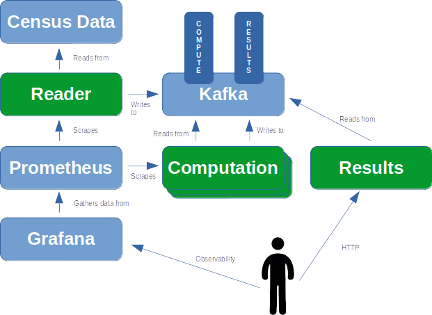

# Kafka Scale

**kafka-scale** is a Go language demo application that demonstrates parallelizing and distributing a compute task across several Pods in a Kubernetes cluster. The app reads and summarizes census data. Census data was chosen for this demo app because it is readily available, and there is a reasonable volume of it to test the scalability of the application and observe the impact of increasing the number of compute replicas. The goal of the project is to demonstrate a scalability pattern. So the actual data being consumed is less important. Presumably the pattern can be applied to any data set in which independent computation threads can run in parallel without needing to access to each other's data to do their work.

The app reads census data sets from the US Census site, and chunks the data into Kafka. Other instances of the program consume data from Kafka, perform a computation on it and put it back into Kafka. A third instance of the program reads the computed data from Kafka and summarizes the results in memory which can then be queried via a REST call:




The blue components are open source or publicly available. The green components are what this project provides.

One of the goals of the project was to simplify the components in green as much as possible. Therefore, all concurrency, scaling, deployment, synchronization, etc. are delegated to Kubernetes and Kafka.

<u>Diagram Narrative</u>:

1. A *Reader* pod reads census Gzips from the US Census site. The reader breaks the gzips into chunks and writes the chunks into a Kafka **compute** topic. If the topic does not exist when the app starts, the app creates the topic. The partitions and replication factors of the topic are configurable through command line params
2. Multiple *Computation* pods consume the **compute** topic as part of a Kafka consumer group. These pods perform a calculation on the message chunks, and write the data into a Kafka **results** topic. Again - if the results topic does not exist it is created automatically. Multiple replicas are supported. This is where the parallelization comes from. You can scale your Kafka cluster and this deployment up in parallel
3. A single *Results* pod reads from the Kafka **results** topic, summarizes the data, and holds the data in memory where it can be viewed via HTTP using curl or the browser. The project contains a manifest for a NodePort service that enables access to the results endpoint. Of course depending on the Kubernetes environment that runs this demo, access to the endpoint could be achieved in various different ways
4. Prometheus and Grafana are used to provide observability. A Grafana dashboard is included in the project for this purpose. It can be imported into the Grafana instance running in the cluster, and it has a *Prometheus* data source in it

### Environment

This demo assumes you have a Kubernetes cluster available to you. I use [desktop-kubernetes](https://github.com/aceeric/desktop-kubernetes) for local testing, which is a project I built that stands up a three-node Kubernetes dev cluster on your desktop using VirtualBox. Desktop Kubernetes is derivative of Kelsy Hightower's *Kubernetes the hard way*.

It also assumes you have an observability stack. I use [kube-prometheus](https://github.com/prometheus-operator/kube-prometheus). This project includes a Grafana dashboard JSON file that you can import into Grafana in the cluster to monitor the *kafka-scale* application as it runs.

Finally, this demo assumes you have Kafka running in cluster. I use [Strimzi](https://strimzi.io/) for this.

### The Code

The application code consists of a single Go package, and compiles to a single Go binary. The binary - `kafka-scale` - accepts a positional param (along with other configuration params) to control the role that it plays in the cluster. The following positional params are supported.

| Param     | Role                                                         |
| --------- | ------------------------------------------------------------ |
| read      | Reads from the census website, chunks the data, writes to the **compute** Kafka topic |
| compute   | Reads from the **compute** Kafka topic, performs some basic computation on the data, writes the computed result to the **results** Kafka topic |
| results   | Reads the **results** Kafka topic, summarizes to an in-memory data structure, and serves the data structure as JSON via a **/results** endpoint. E.g.: `curl --silent -H "Accept: application/json"  http://192.168.0.46:32099/results` |
| topiclist | Lists all the Kafka topics. Same as `kubectl get kafkatopics` if you're running Strimzi |
| offsets   | Lists the offsets for a Kafka topic - lets you see the lags for a topic |
| rmtopics  | Removes topics. If you're running Strimzi, then `kubectl delete kafkatopic <mytopic>` because otherwise Strimzi will see the topic removal as a reconciliation event, and re-create the topic for you |

The code makes use of the [kafka-go](https://github.com/segmentio/kafka-go) Kafka client library from [Segment](https://segment.com/).


### Observability

The application includes the Prometheus client libraries and exposes Prometheus metrics on a configurable port. The following metrics are exposed:

| Metric                                |                                                              |
| ------------------------------------- | ------------------------------------------------------------ |
| `kafka_scale_downloaded_gzips`        | The Count of census gzip files downloaded from the US Census website |
| `kafka_scale_chunks_written`          | The Count of Census data chunks written by the read command to the compute topic |
| `kafka_scale_compute_messages_read`   | The Count of messages read by the compute command from the compute topic |
| `kafka_scale_result_messages_written` | The Count of messages written by the compute command to the results topic |
| `kafka_scale_result_messages_read`    | The Count of messages read by the result command from the results topic |


### How To Run The App

The manifests directory contains several manifests that run the application. Once you apply these manifests, census data will immediately start coming down into your cluster.

```shell
$ kubectl create namespace kafka
$ find manifests -name '*.yaml' -maxdepth 1 | xargs kubectl apply -f
```

The reader is configured out of the box to create the compute topic with 10 partitions, but only two compute replicas are created. The compute deployment can be modified in cluster to scale up to 10 replicas to observe the performance improvement from increased parallelization.

### Manifests

The `manifests` directory contains the following manifest files that comprise the application:

| Manifest                           | Description                                                  |
| ---------------------------------- | ------------------------------------------------------------ |
| read-job.yaml                      | Reads census gzips as configured by command-line params. Chunks the data and writes the chunks to the compute topic. Creates the compute topic if it does not already exist with configurable partitions and replicas. Typically, you will create one partition for each replica of the compute deployment. The manifest is a Job, because once it reads and chunks all the data, it has nothing else to do |
| compute-deployment.yaml            | Creates a deployment with as many replicas as you specify. Reads from the compute topic populated by the read job, performs a simple computation, and writes the computed result to the results topic. The compute topic is consumed as part of a consumer group. So typically the number of replicas of this deployment will be less than or equal to the number of partitions of the compute topic. If there are more replicas of this deployment than partitions, then the consumer group will not provide those replicas with data |
| results-deployment.yaml            | Creates a deployment with one replica. This pod reads from the results topic and summarizes the data into a Go `struct` which it serves via a configurable port on the **/results** endpoint |
| compute-podmonitor.yaml            | Creates a `PodMonitor` CR that wires Prometheus up to scrape the application pods for exposed metrics. You'll need to configure the Prometheus Operator to watch for `PodMonitor` CRs in all namespaces. From my experience, this is the default configuration for `kube-prometheus` |
| prometheus-rbac.yaml               | RBACs to allow Prometheus to scrape the application pods for metrics |
| kafka-scale-grafana-dashboard.json | This is a Grafana Dashboard that provides visibility into what the application is doing. The kube-prometheus stack doesn't deploy the Grafana Operator. So - to use kube-prometheus with custom dashboards like this it is easiest just to import the dashboard JSON into Grafana via the Grafana UI |
| results-service.yaml               | A NodePort service that enables you to access the results endpoint without port-forwarding. Again - I test this in a desktop cluster so this may or may not be useful or necessary or even possible depending on your Kubernetes environment |

### Building

The project `Makefile` is how you build. There are two top-level targets:

`local-build`

This target builds the app to the desktop.  This supports desktop testing of the app against Kafka in the cluster.

`quay`

This target does a containerized build and push using **podman**, with the resulting image going to: `quay.io/appzygy/kafka-scale` with the version specified in the Make file (probably 1.0.0).